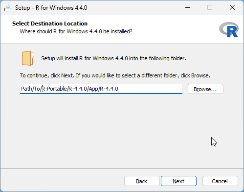

# Making R-Portable Distributions

This repository assists the user with making Portable R Distributions using 
the Portable Apps Framework....sort of. (I have yet to figure out how to convert
the zip files produced here into a format that can be submitted to PortableApps.com).

These files work for making R-Portable distributions for Windows operating systems.
I rely on Portable R for several use-cases in my professional work. I had been
able to download these from portableapps.com, but the user who had been producing
those seems to have stopped after R 4.2.0.  Many thanks to Bill Huber for his 
contributions.

## Prerequisites

* Have a working version of R installed. (It could be one of the older versions of Portable R)
* Have permission to install R on your Windows machine.

Keep in mind, this repository doesn't keep copies of R Portable distributions. It provides the tools to make them.


## Usage

After downloading and extracting the files in this repository, open R and 
set the working directory to the path where you've saved these files. 

Run the following:

```
# Versions to make portable
VERSION <- "4.4.0"  # or whichever version you like

# Directory into which the portable versions will be installed
INSTALL_TO <- "Path/To/R-Portable"

# Direcotry with the configuration templates
TEMPLATE_DIR <- file.path(getwd(), "00-Templates")

invisible({
  lapply(list.files("01-R-functions", 
                  full.names = TRUE), 
       source)
})

portablize(version = VERSION, 
           install_to = INSTALL_TO, 
           template_dir = TEMPLATE_DIR)
```

As part of the installation, a message is printed to the console: 
`Install R to: Path/To/R-Portable/R-x.y.z/App/R-x.y.z`

Copy this path to enter into the R installation dialog:


